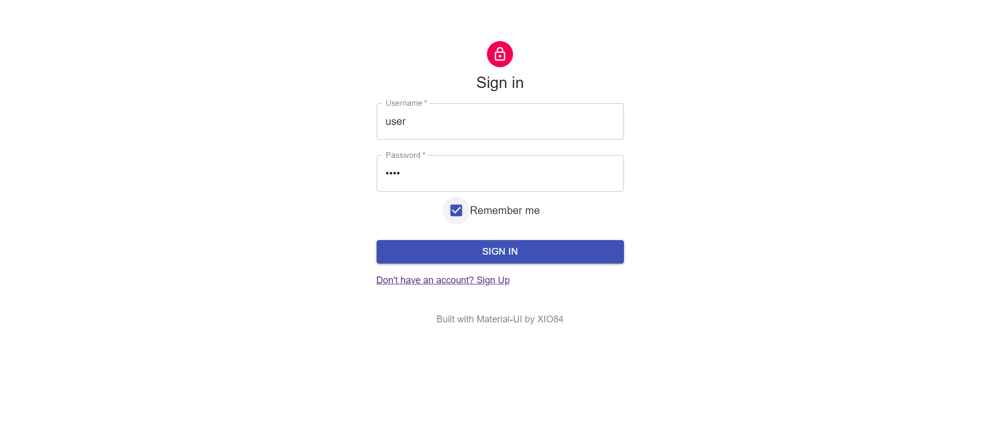

# miNIMalist Finder
## Untuk seleksi 2 Labpro
## Nama : T. Antra Oksidian Tafly
## NIM : 13517020

This project was bootstrapped with [Create React App](https://github.com/facebook/create-react-app).
To view the website, [Click here](https://xio84.github.io/NIMFinder/)

## Apa ini?? / Ringkasan aplikasi
Sebuah NIM Finder ITB menggunakan React,

## Bagaimana Caranya?? / Cara memakai aplikasi
### Pemasangan : jalankan `npm run start` di terminal anda
Tetapi jika anda online dan sedang membaca ini, silahkan ke: https://xio84.github.io/NIMFinder/
### Memakai aplikasi:
#### Login:

Silahkan masukkan username dan password lalu tekan enter atau klik Sign In untuk masuk, centang remember me untuk menyimpan username dan password. Jika belum terdaftar, klik link di bawah tombol.
#### Register:

Silahkan masukkan username dan password lalu tekan enter atau klik Sign Up untuk mendaftar, jika pendaftaran sukses akan muncul notifikasi seperti pada gambar.
#### Memasukkan Query:

Silahkan masukkan Nama/NIM dalam kotak yang sesuai lalu tekan enter atau tekan tombol yang sesuai, jika ingin keluar tekan tombol log out di kanan atas
#### Navigasi Data:
Silahkan tekan tombol yang berada di bawah tabel untuk berpindah halaman. Tekan angka disamping rows per page untuk mengubah jumlah data per halaman.

## Apa Isinya?? / Desain aplikasi
### Kelas-kelas yang dibuat: 
`Login = Kelas untuk menangani Login page`
`Register = Kelas untuk menangani Register page`
`Dashboard = Kelas untuk menangani halaman utama`
`Results = Kelas untuk menyimpan data hasil pencarian`
### Fungsi-fungsi yang dibuat:
`Main = fungsi penanganan routing`
`MySnackbarContentWrapper = fungsi pengatur snackbar`
`TablePaginationActions = fungsi pengatur tombol di footer tabel`
### Cara aplikasi bekerja:
Dengan menggunakan BrowserRouter dari react-router, aplikasi berpindah-pindah dalam 3 komponen: Login, Register, dan Dashboard.
Login mengambil token menggunakan endpoint `\login` dan dapat menyimpan credentials dengan localstorage
Register mendaftarkan credentials dengan endpoint `\register`
Dashboard menyimpan query yang ingin dicari dan memberikannya ke turunannya, Results
Results yang merupakan turunan Dashboard akan mengambil data melalu `\byid` atau `\byname` dan menampilkannya
### Design Pattern
Untuk UI : Decorator design pattern, dengan menggunakan makeStyles milik material-ui, dapat dibuat sebuah Higher-Order Component yang merupakan sebuah turunan kelas yang didekorasi.
Untuk Sign In / Sign Up : Singleton design pattern, karena dalam page-page ini, tidak diperlukan struktur yang kompleks
Untuk Proses Data : Mediator design pattern, dengan menggunakan kelas results, penampilan dan pemanggilan data dapat dimediasi oleh kelas results

## Ada Tambahan?? / Library dan kakas yang dipakai
`react-router` : Untuk routing dan redirecting, [sumber](https://github.com/ReactTraining/react-router)

`axios` : Untuk HTTP Request, [sumber](https://github.com/axios/axios)

`query-string` : Untuk mengubah data form menjadi string, dipakai bersama axios, [sumber](https://www.npmjs.com/package/query-string)

`@material-ui` : Untuk UI/UX, [sumber](https://material-ui.com/)

## Pendapat Anda?? / Review API
### Kelebihan:
Cepat dan tepat.
### Kekurangan:
Tidak adanya pemberitahuan total halaman data yang ada (Harus mengakses per page).
